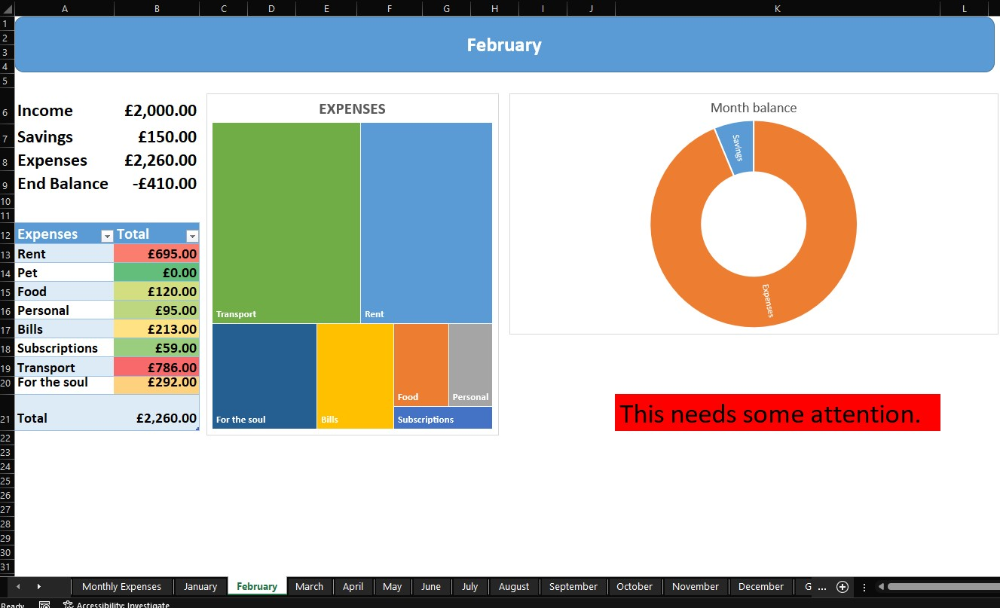
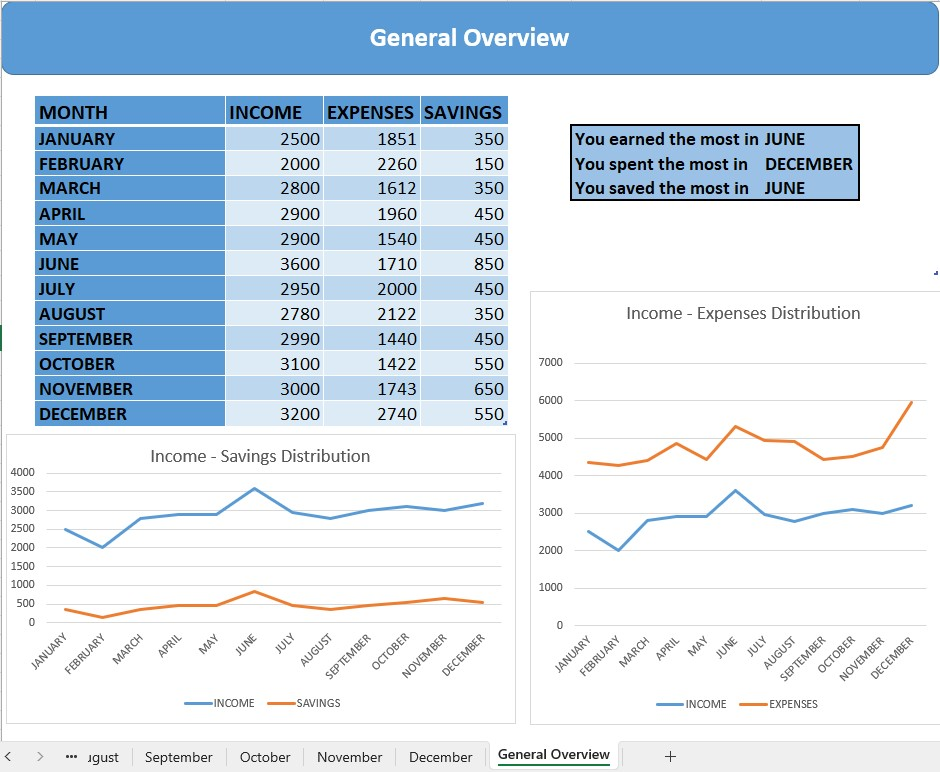

# Monthly_Budget
 
 
Budgeting can be a challenging task and any assistance is appreciated. I personally faced difficulty finding a suitable budget tracker, which led me to create my own budget template using MS Excel. To demonstrate its functionality, I included some random values.

The workbook includes a sheet called 'Enter Data,' where spending information is entered. 
This sheet contains categories such as 
  - income
  - savings
  - spendings (including essentials, bills, subscriptions, transport, and discretionary spending). 
        
To customize the template to different needs, separate tables were added for each category, and named ranges were used in the calculations to allow for additional rows.
 

 
 
For each month of the year, there is a sheet that provides a snapshot of income, savings, expenses, and the end balance for that specific month. The actual amount of money spent in each category can be viewed in a table that includes conditional formatting, with red highlighting the highest spend. To make the spending distribution easier to understand, I used a tree map.

To determine if we did well (positive balance) or need to be more cautious (negative balance), I used an IF statement to conclude each month. 

 
 
 
 
The 'General Overview' sheet summarizes the income, expenses, and savings for every month. I added two linear graphs to show how expenses and savings change in relation to income. Additionally, I utilized an INDEX and MATCH function to identify the month with the highest income, savings, and expenses.
 
  
